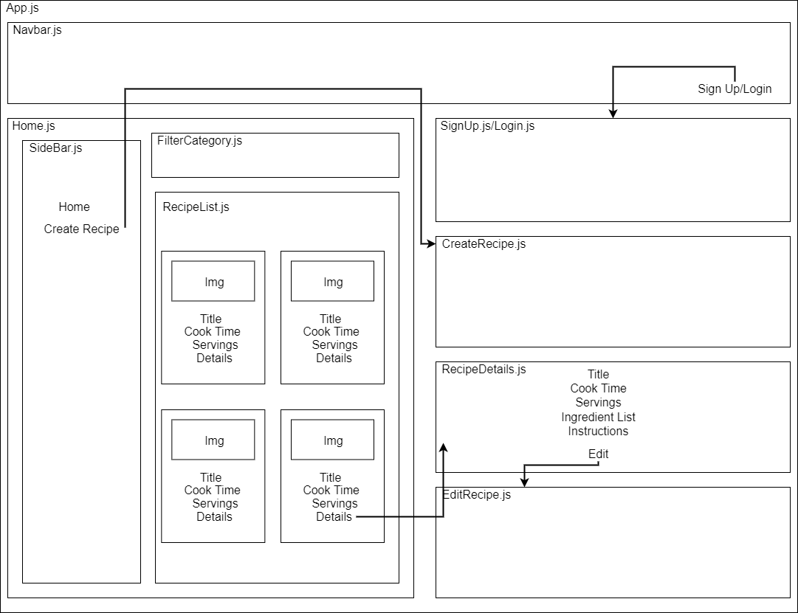

## Component Diagram

## Research & Planning Log

Friday, 02/18/22

* 8:30 - fill out project proposal
* 9:15 - meet with another student working on similar project to bounce ideas off of(databases, uploading images)
* 9:45 - start looking for C#/React web app tutorials
* 10:15 - watch 1 hour C#/React tutorial and build practice project with it (https://www.youtube.com/watch?v=ON-Z1iD6Y-c)
* 11:45 - research Firebase/Firestore and React, review docs, go down the YouTube rabbit hole
* 12:45 - scrap earlier C#/MySQL plan and revise capstone proposal to use Firebase/Firestore instead
* 1:00 - watch React & Firebase tutorial (https://www.youtube.com/watch?v=jCY6DH8F4oc&t=109s)
* 2:30 - watch Firebase Auth tutorial playlist and code along with videos (https://www.youtube.com/playlist?list=PL4cUxeGkcC9jUPIes_B8vRjn1_GaplOPQ)
* 3:30 - stopped watching above playlist, it's a little outdated
* 3:35 - start watching React Auth with Firebase video (https://www.youtube.com/watch?v=PKwu15ldZ7k)
* 4:30 - start working through Firebase lessons on Learn How To Program

* Total hours: 7.5

Friday, 02/25/22

* 8:15-8:30 - make a plan for today's work
* 8:30-9:40 - re-read Epicodus materials on Redux, trying to determine the best way to manage state in my app
* 9:40-11:00 - review materials on React Hooks, research using useState hook
* 11:00-11:20 - decided to use combination of Redux and the useState hook, looking for code examples of implementing both
* 11:20-11:30 - break
* 11:30-12:25 - watch video on React Redux with hooks (https://www.youtube.com/watch?v=9jULHSe41ls)
* 12:30-1:30 - lunch break
* 1:40-3:15 create component diagram (this took much longer than expected, I had to really think about how to divide up all of my app components)
* 3:15-3:30 - break
* 3:30-4:00 - research best practices for ingredient & measurement entry, start thinking about how my forms will look
* 4:00-5:00 - read React-Bootstrap documentation on forms, test out ideas on their in browser editor

* Note to future Katie: solve the ingredient form issue by using React-Bootstrap elements (specifically an InputGroup with multiple FormControl elements and a DropdownButton) and an "Add" button for each ingredient entry.

* Daily hours: 6.9
* Total hours: 14.4

Saturday, 02/26/22

* 10:20-10:50 - dig into Firestore documentation to better understand collections and documents
* 10:50-11:25 - watch videos linked in Firestore docs (https://www.youtube.com/watch?v=o7d5Zeic63s) and (https://www.youtube.com/watch?v=haMOUb3KVSo)
* 11:30 - create test Firestore db to mess with different database structures

* Daily hours:
* Total hours: 

